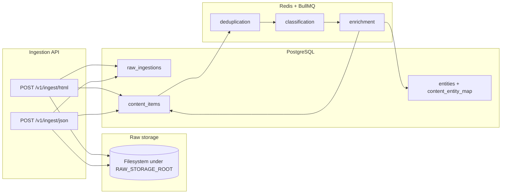

# Sports data aggregation backend

Production-style API backend for ingesting **raw HTML** (crawlers) and **JSON** (social/APIs), storing artifacts, normalizing into PostgreSQL, and processing **deduplication → classification → enrichment** via **BullMQ** workers. **LLMs** are used only in workers for classification, entity extraction, and summarization—not for primary HTML/JSON parsing.

## Requirements

- **Node.js** 20+
- **Docker** (recommended) for PostgreSQL, Redis, and optional Elasticsearch

## Quick start

1. **Clone / open** this directory:

   `sports-data-backend/`

2. **Environment**

   ```bash
   copy .env.example .env
   ```

   Edit `.env` if ports or credentials differ.

3. **Infrastructure**

   ```bash
   docker compose up -d postgres redis
   ```

   Optional full-text search:

   ```bash
   docker compose up -d elasticsearch
   ```

   Then set `ELASTICSEARCH_URL=http://localhost:9200` in `.env`.

4. **Install and migrate**

   ```bash
   npm install
   npm run db:migrate
   ```

5. **Run API** (terminal 1)

   ```bash
   npm run dev
   ```

   Default: `http://localhost:3000`

6. **Run workers** (terminal 2)

   ```bash
   npm run worker
   ```

   Without workers, ingest returns `202` but **deduplication, classification, and enrichment** will not run.

7. **Production build**

   ```bash
   npm run build
   npm start
   npm run worker:prod
   ```

## Web UI ()

The **Kinetic Editorial** frontend lives in **`../stitch/web`** (Vite + React). It reads data only through this API (`/v1/...`). Dev server proxies to `http://localhost:3000`. See **`../stitch/README.md`**.

## Architecture



- **Ingestion**: validates payload, writes **raw files** (HTML/JSON), upserts **`raw_ingestions`** (idempotency on `source` + `external_key`), parses/normalizes, upserts **`content_items`**, enqueues **deduplication** job.
- **Deduplication worker**: same **`body_hash`** as an older row → mark **`duplicate_skipped`** and link **`duplicate_of_id`**; otherwise enqueue **classification**.
- **Classification worker**: LLM (or heuristic fallback) → **`classification_sport`**, **`sentiment`**; then enqueue **enrichment**.
- **Enrichment worker**: LLM (or heuristic) → **`summary`**, **`entities`** + **`content_entity_map`**; optional **Elasticsearch** index; invalidates **trending** Redis cache.

Parsing:

- **HTML**: Cheerio (`src/parsers/htmlParser.ts`) for title, author, dates, main text, tags.
- **JSON**: Normalizers for Twitter/X-like, YouTube, Instagram, plus a generic envelope (`src/parsers/jsonNormalizer.ts`).

## Project layout

| Path | Role |
|------|------|
| `src/server.ts` | HTTP server entry |
| `src/api/` | Routes, DTO serialization |
| `src/services/ingestionService.ts` | End-to-end ingest transaction |
| `src/parsers/` | HTML + JSON normalization |
| `src/storage/rawStorage.ts` | Raw artifact files (swap for S3 in production) |
| `src/repositories/` | PostgreSQL access |
| `src/db/migrations/` | SQL schema |
| `src/queues/` | BullMQ queues + enqueue helpers |
| `src/workers/` | Deduplication, classification, enrichment workers |
| `src/llm/enrichment.ts` | OpenAI + fallbacks |
| `src/search/elasticsearch.ts` | Index + search (optional) |
| `src/cache/trendingCache.ts` | Trending cache in Redis |

## Database schema (summary)

- **`raw_ingestions`**: `source`, `external_key` (unique with `source`), `content_hash`, `artifact_path`, `artifact_kind`, `fetched_at`.
- **`content_items`**: normalized article/post fields, `body_hash`, `raw_ingestion_id`, enrichment fields, optional `duplicate_of_id`.
- **`entities`**: `name`, `type` (`player` \| `team` \| `sport` \| `other`), case-insensitive uniqueness per type.
- **`content_entity_map`**: many-to-many **content** ↔ **entity**.

Full DDL: `src/db/migrations/001_initial.sql`.

## Idempotency

- **Raw ledger**: `UNIQUE (source, external_key)`. Default keys are derived from source + URL (HTML) or source + platform + id/payload hash (JSON). Clients may send **`idempotency_key`** to control the key explicitly.
- **Structured row**: `UNIQUE (platform, platform_id)` when `platform_id` is set (e.g. same tweet ID updates the row on re-ingest).

## REST API

Base URL: `http://localhost:3000` (or your `PORT`).

| Method | Path | Description |
|--------|------|-------------|
| `POST` | `/v1/ingest/html` | Ingest HTML page |
| `POST` | `/v1/ingest/json` | Ingest API JSON blob |
| `GET` | `/v1/content` | List structured content (`limit`, `offset`, `platform`) |
| `GET` | `/v1/content/enriched` | Same, `enrichment_status = complete` only |
| `GET` | `/v1/content/:id` | Single item by UUID |
| `GET` | `/v1/content/by-entity/:name` | Items linked to entities matching name (`?limit=`) |
| `GET` | `/v1/trending` | Trending by engagement (`?limit=`), Redis-backed cache |
| `GET` | `/v1/search?q=&limit=` | Full-text search (requires Elasticsearch) |
| `GET` | `/health` | Liveness |

### `POST /v1/ingest/html`

JSON body:

- `source` (string, required): crawler or site label.
- `url` (string, required): canonical URL for this document.
- `html` (string, required): raw HTML.
- `fetched_at` (optional ISO string).
- `idempotency_key` (optional string).

Response **`202`**: `{ "status": "accepted", "content_id", "raw_ingestion_id" }`.

### `POST /v1/ingest/json`

JSON body:

- `source` (string, required).
- `platform` (optional string hint, e.g. `twitter`).
- `payload` (required): arbitrary JSON (Twitter/YouTube/Instagram shapes supported; see normalizer).
- `fetched_at`, `idempotency_key` (optional).

Response **`202`**: same shape as HTML ingest.

## Environment variables

See `.env.example`. Important:

| Variable | Purpose |
|----------|---------|
| `DATABASE_URL` | PostgreSQL connection string |
| `REDIS_URL` | Redis for BullMQ + trending cache |
| `RAW_STORAGE_ROOT` | Directory for raw HTML/JSON files |
| `OPENAI_API_KEY` | If unset, workers use **heuristic** classification/summary/entities |
| `OPENAI_MODEL` | Default `gpt-4o-mini` |
| `ELASTICSEARCH_URL` | If unset, `/v1/search` returns **503** |

## Queues and reliability

- Queues: **`deduplication`**, **`classification`**, **`enrichment`**.
- Jobs use **exponential backoff** and multiple **attempts** (see `src/queues/publishers.ts`).
- Scale horizontally by running **multiple worker processes** (same `REDIS_URL` and `DATABASE_URL`).

## Operational notes

- **Raw files** grow under `RAW_STORAGE_ROOT`; archive or sync to object storage in production.
- **Elasticsearch** index name: `content_items` (created on first index if missing).
- **Trending** cache TTL is short (see `src/cache/trendingCache.ts`); enrichment invalidates cache when documents complete.

## License

Private / use per your organization. Adjust as needed.
